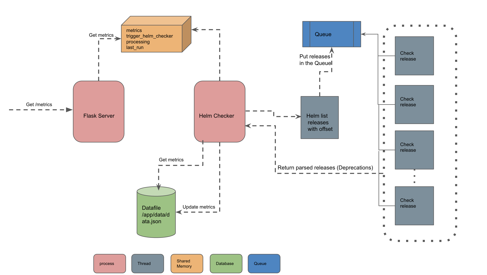

# Implementation Details

This document outlines the implementation details of `kdave-server`

`kdave-server` is a combination of Multiprocessing and Multithreading application. Two processes are running, one is the `flask` process to serve the incoming requests and the other is `helm-checker` process which runs an endless loop waiting for a request or trigger from the `flask` process to check for any deprecated or removed apiVersions in the deployed helm releases.
The flask process exposes the endpoint `/metrics` to return the deprecated or removed apiVersions in a Prometheus metrics format.

Below is the lifecycle of a request coming to the Application.

* When the request come to the `flask` process, it will check for the metrics in a shared memory location between the two processes (`flask` and `helm-checker`)
* If the metrics exist, it'll check the timestamp to see if they are updated or not.
* If the metrics are updated, it'll return the metrics to the requester and the request lifecycle will end here.
* If the metrics don't exist in the shared memory or exist but not updated, the `flask` process will trigger the `helm-checker` process by setting the `trigger_helm_checker` flag to `true`.
* The `helm-checker` process continuously checks for these two flags to see if it should start its logic. These flags are `trigger_helm_checker=true` and `processing=false`
* The `helm-checker` process will switch the flag `processing` to `true` and start its logic. This will prevent running the threads more than one time to check the deprecations.
* The `helm-checker` process will check for the metrics in the data file first. If they exist and they are updated, the metrics will be loaded from this data file and `helm-checker` will switch the above flags back to their original state.
* If the metrics in the data file are not updated, the `helm-checker` process will trigger few threads to get the current deployed releases and check the used Kubernetes apiVersions in these releases.
* One thread, let's call it `helm-list` thread, will list all the releases in the cluster and put them in the queue
* If the releases are more than the default number of releases to fetch which is 256, the `helm-list` thread will page through the result using the offset and the next release index and will put all the releases in the queue.
* While the above `helm-list` thread is working to list the releases in the cluster and put them in the queue in chunks, other threads `release-checker` will check the deprecations for these releases in the queue
* The `release-checker` threads will keep running until the Exit Event is set by the `helm-list`
* The `helm-list` thread will set the Exit Event when there's no items/releases in the queue. So, all the threads will keep running until all the releases are checked.
* Finally the result will come back to the `helm-checker` process
* The `helm-checker` process will update the metrics in the shared memory and update the data file with the new data or metrics and will update the timestamp for these metrics.
* The next request will have the updated metrics served from the shared memory location.
